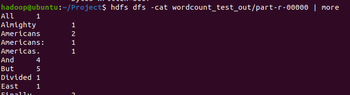
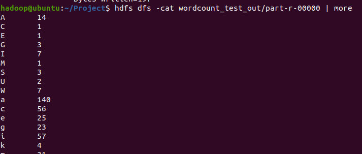
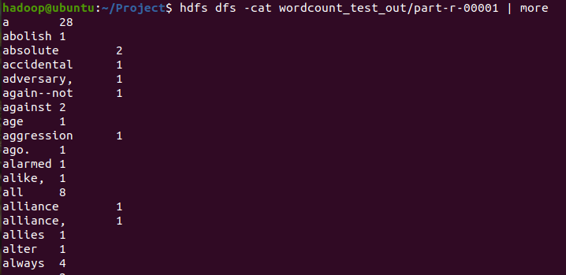
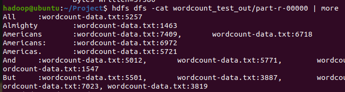
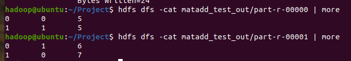

# 하둡 과제 풀이 

[Day1] Wordcount.java : 입력 파일의 단어의 빈도 수를 화면에 출력하는 프로그램

[Day1] Wordcount1char.java : 입력 파일의 단어의 첫 번째 글자 빈도 수를 화면에 출력하는 프로그램

[Day2] Wordcountsort.java : 입력 파일에 단어빈도를 알파벳 순으로 출력하는 프로그램

[Day2] InvertedIndex.java : 입력 파일에 있는 단어를 사용하여 역색인을 출력하는 프로그램

[Day2] MatrixAdd.java : 두 행렬의 덧셈을 계산해서 출력하는 프로그램
